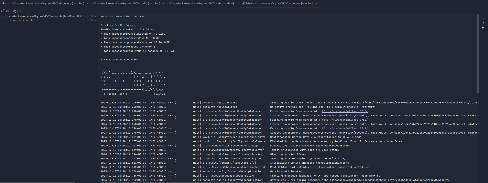
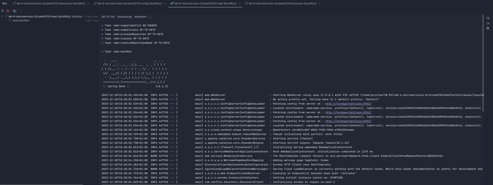
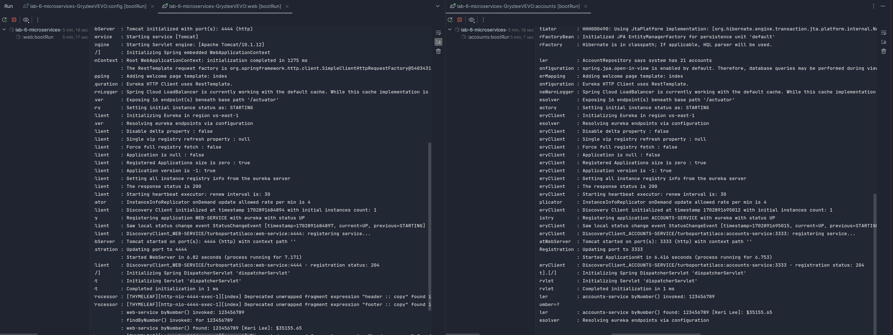

# LAB 6 REPORT

Author: Dorian Boleslaw Wozniak (817570@unizar.es)

## Two services `accounts (2222)` and `web` are running and registered (two terminals).

After launching the discovery and config services required for configuring and registering the microservices, the
`accounts` and `web` services are launched on ports 2222 and 4444, respectively.

To test it, the web microservice is accessed through the browser at `http://localhost:4444/` and the 'Fetch by name'
option is selected.

## The service registration service has these two services registered (a third terminal).

## Update the configuration repository so that the accounts service uses now the port 3333.

## Run a second instance of the accounts service using the new configuration (a fourth terminals).

## What happens when you kill the service accounts (2222) and do requests to web?. 

## Can the web service provide information about the accounts again?. Why?