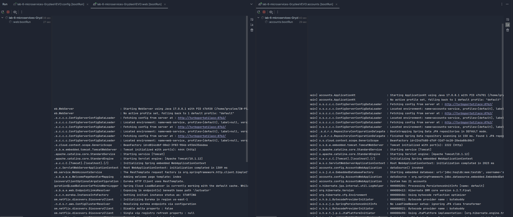
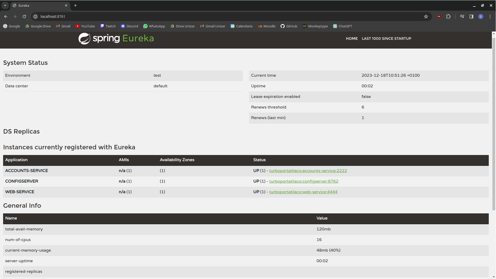
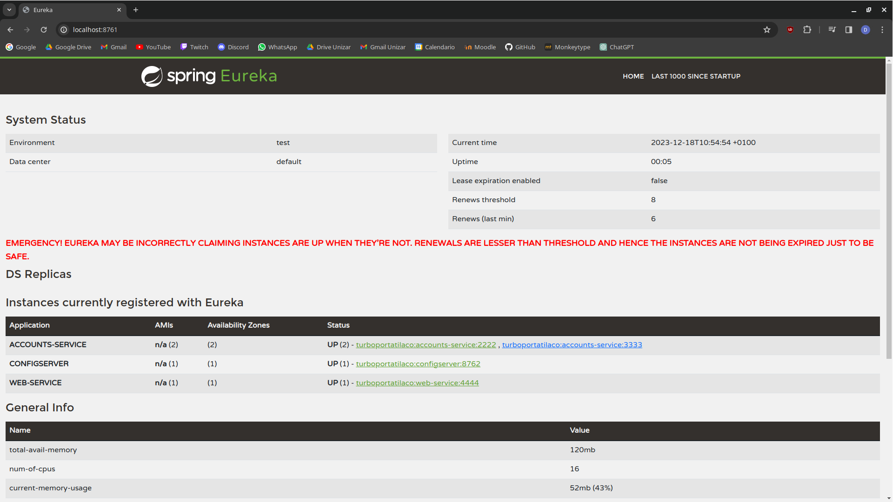
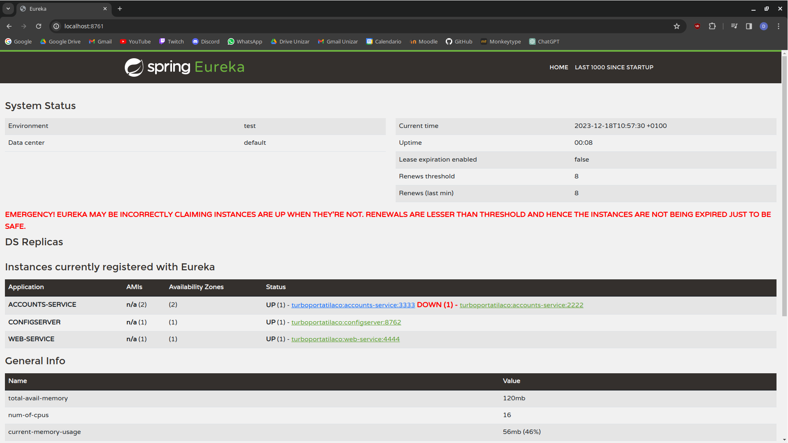
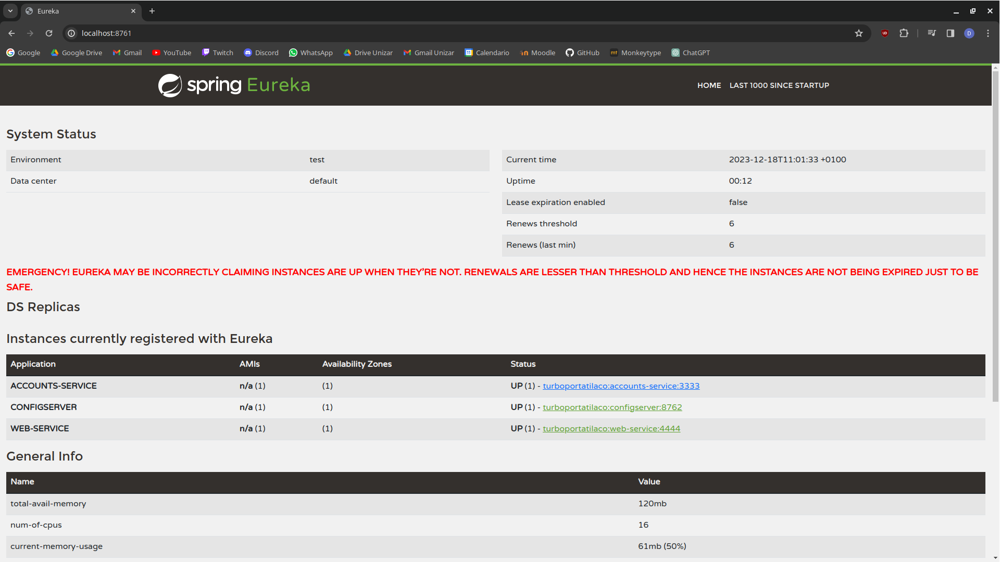
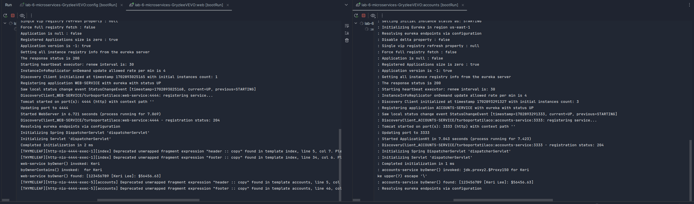

# LAB 6 REPORT

Author: Dorian Boleslaw Wozniak (817570@unizar.es)

## Two services `accounts (2222)` and `web` are running and registered (two terminals).

After launching the discovery and config services required for configuring and registering the microservices, the
`accounts` and `web` services are launched on ports 2222 and 4444, respectively.

To test it, the web microservice is accessed through the browser at `http://localhost:4444/` and the 'Fetch by name'
option is selected.

## The service registration service has these two services registered (a third terminal).

## Update the configuration repository so that the accounts service uses now the port 3333.

The update can be seen in the following [commit](https://github.com/GryzleeVEVO/lab6-microservices-config-repo/commit/20bc12ba6a94ef1030662270f6456740ea050851)

## Run a second instance of the accounts service using the new configuration (a fourth terminals).

Now two instances of the accounts service are running on ports 2222 and 3333 and any application may use either of them two.

## What happens when you kill the service accounts (2222) and do requests to web?. 

When the service on port 2222 is killed, the web service is still accessible.

## Can the web service provide information about the accounts again?. Why?

After a while, the downed accounts service is removed. When requesting the new accounts service from the web service,
the new instance is used and the information is correctly retrieved.

In this case, the web service only searches for accounts but does not create them. In that case, there might be necessary
additional steps to ensure consistency if one of the service instances is down (i.e. a distributed database).